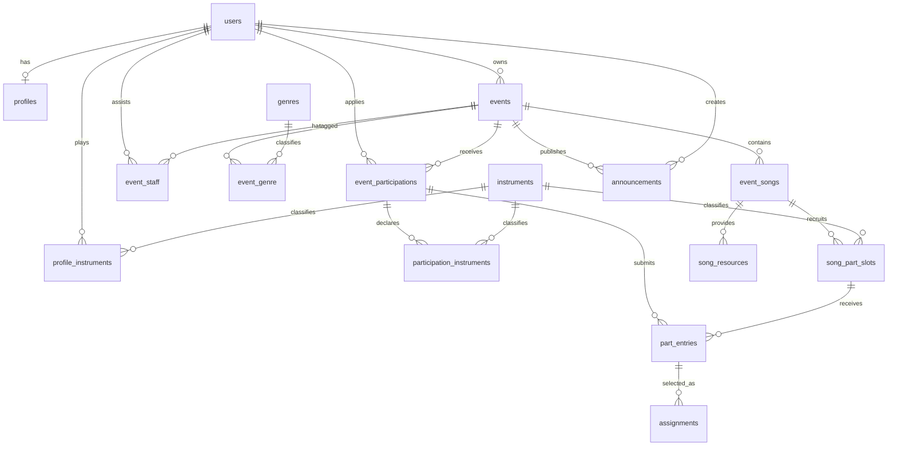

# 物理データベース設計

## 方針

- DBMSは既存構成に合わせてMySQLを使用する。
- Laravel標準の`users`を認証主体として利用する。
- Laravelのログインセッション用に`sessions`が存在するため、音楽セッションは`events`と命名する。
- 状態値はDB固有のENUMではなく文字列で保存し、PHP Enumとバリデーションで制約する。
- 日時はUTCで保存し、画面表示時にイベントのタイムゾーンへ変換する。
- 金額は整数の最小通貨単位で保存する。日本円なら`fee_amount = 3000`とする。
- 公開後のイベントは原則として物理削除せず、状態変更で管理する。

## MVPで確定した運用ルール

| 項目 | MVPの仕様 |
| --- | --- |
| 参加方式 | 運営者による承認制 |
| 応募曲数上限 | イベントごとに設定。`NULL`は無制限 |
| 担当曲数上限 | イベントごとに設定。`NULL`は無制限 |
| 希望順位 | 参加者ごと、イベント全体で重複不可 |
| 見送り理由 | 任意の参加者向けメッセージ |
| 参加キャンセル | 即時確定し、応募取消・担当解除を同一トランザクションで行う |
| 演奏資料 | 外部URLのみ |

## テーブル関連図

## テーブル定義

全テーブルは特記がない限り`id BIGINT UNSIGNED`、`created_at`、`updated_at`を持つ。

### profiles

`users`と1対1の公開プロフィール。

| カラム | 型 | 制約・用途 |
| --- | --- | --- |
| user_id | BIGINT UNSIGNED | FK users、UNIQUE、CASCADE |
| bio | TEXT | NULL可 |
| region | VARCHAR(100) | NULL可 |
| experience_level | VARCHAR(20) | NULL可 |

`experience_level`は`beginner`、`intermediate`、`advanced`、`professional`を候補とする。

プロフィール画像はMVP対象外のため、画像パスは保持しない。将来追加する場合はアップロード、削除、ファイル検証、既存画像の後始末を一つの機能として設計する。

### instruments

検索と編成に使用する楽器・パートのマスター。

| カラム | 型 | 制約・用途 |
| --- | --- | --- |
| name | VARCHAR(100) | UNIQUE |
| slug | VARCHAR(100) | UNIQUE |
| sort_order | SMALLINT UNSIGNED | DEFAULT 0 |
| is_active | BOOLEAN | DEFAULT true |

### profile_instruments

| カラム | 型 | 制約・用途 |
| --- | --- | --- |
| user_id | BIGINT UNSIGNED | FK users、CASCADE |
| instrument_id | BIGINT UNSIGNED | FK instruments、RESTRICT |
| experience_years | SMALLINT UNSIGNED | NULL可 |
| level | VARCHAR(20) | NULL可 |
| note | VARCHAR(500) | NULL可 |

`UNIQUE(user_id, instrument_id)`を設定する。

### events

音楽セッション本体。

| カラム | 型 | 制約・用途 |
| --- | --- | --- |
| owner_id | BIGINT UNSIGNED | FK users、RESTRICT |
| title | VARCHAR(200) | 必須 |
| slug | VARCHAR(220) | UNIQUE、公開URL用 |
| description | TEXT | NULL可 |
| status | VARCHAR(20) | DEFAULT `draft`、INDEX |
| starts_at | DATETIME | 必須、INDEX |
| ends_at | DATETIME | 必須 |
| timezone | VARCHAR(50) | DEFAULT `Asia/Tokyo` |
| venue_name | VARCHAR(200) | 必須 |
| venue_address | VARCHAR(500) | NULL可 |
| region | VARCHAR(100) | INDEX |
| fee_amount | INT UNSIGNED | DEFAULT 0 |
| currency | CHAR(3) | DEFAULT `JPY` |
| participant_capacity | SMALLINT UNSIGNED | NULL可。承認済み参加者の上限 |
| level_description | VARCHAR(500) | NULL可 |
| participation_deadline | DATETIME | NULL可 |
| entry_deadline | DATETIME | NULL可 |
| max_entry_songs_per_participant | SMALLINT UNSIGNED | NULL可。異なる応募曲数の上限 |
| max_assignment_songs_per_participant | SMALLINT UNSIGNED | NULL可。異なる担当曲数の上限 |
| published_at | DATETIME | NULL可 |
| cancelled_at | DATETIME | NULL可 |

状態は`draft`、`published`、`closed`、`completed`、`cancelled`とする。

### event_staff

共同運営者。主催者は`events.owner_id`で表現し、このテーブルには含めない。`event_id`と`user_id`を持ち、`UNIQUE(event_id, user_id)`を設定する。

### genres / event_genre

`genres`は`name`、`slug`、`sort_order`、`is_active`を持つ。`event_genre`は`event_id`と`genre_id`を持ち、複合UNIQUEを設定する。イベントは複数ジャンルを選択できる。

### event_participations

イベントへの参加申込。プロフィールとは別に申込時点の回答を保持する。

| カラム | 型 | 制約・用途 |
| --- | --- | --- |
| event_id | BIGINT UNSIGNED | FK events、CASCADE |
| user_id | BIGINT UNSIGNED | FK users、RESTRICT |
| participation_type | VARCHAR(20) | `performer`または`observer` |
| status | VARCHAR(20) | DEFAULT `pending`、INDEX |
| experience_level | VARCHAR(20) | NULL可、申込時点の値 |
| introduction | TEXT | NULL可 |
| message_to_organizer | TEXT | NULL可 |
| decision_message | TEXT | NULL可、参加者にも表示 |
| decided_by | BIGINT UNSIGNED | FK users、NULL可、SET NULL |
| decided_at | DATETIME | NULL可 |
| cancelled_at | DATETIME | NULL可 |

`UNIQUE(event_id, user_id)`を設定する。状態は`pending`、`approved`、`rejected`、`cancelled`とする。

### participation_instruments

参加申込時点で申告した楽器を保持する。`participation_id`と`instrument_id`を持ち、複合UNIQUEを設定する。

### event_songs

| カラム | 型 | 制約・用途 |
| --- | --- | --- |
| event_id | BIGINT UNSIGNED | FK events、CASCADE |
| title | VARCHAR(200) | 必須 |
| artist_name | VARCHAR(200) | NULL可 |
| original_key | VARCHAR(20) | NULL可 |
| performance_key | VARCHAR(20) | NULL可 |
| duration_seconds | SMALLINT UNSIGNED | NULL可 |
| structure_note | TEXT | NULL可 |
| performance_note | TEXT | NULL可 |
| setlist_order | SMALLINT UNSIGNED | NULL可 |
| is_published | BOOLEAN | DEFAULT true |

`INDEX(event_id, setlist_order)`を設定する。公開済みイベントでは物理削除せず、非公開化する。

### song_part_slots

| カラム | 型 | 制約・用途 |
| --- | --- | --- |
| event_song_id | BIGINT UNSIGNED | FK event_songs、CASCADE |
| instrument_id | BIGINT UNSIGNED | FK instruments、RESTRICT |
| label | VARCHAR(100) | 例：ギター1、コーラス |
| required_count | SMALLINT UNSIGNED | DEFAULT 1 |
| is_required | BOOLEAN | DEFAULT true |
| is_open | BOOLEAN | DEFAULT true |
| note | VARCHAR(500) | NULL可 |
| was_filled | BOOLEAN | DEFAULT false、再募集判定用 |

`UNIQUE(event_song_id, instrument_id, label)`を設定する。

### part_entries

| カラム | 型 | 制約・用途 |
| --- | --- | --- |
| participation_id | BIGINT UNSIGNED | FK event_participations、CASCADE |
| song_part_slot_id | BIGINT UNSIGNED | FK song_part_slots、CASCADE |
| priority | INT UNSIGNED NULL | 有効応募では1以上。一括入替中のみNULL可 |
| status | VARCHAR(20) | DEFAULT `applied`、INDEX |
| requested_key | VARCHAR(20) | NULL可 |
| can_chorus | BOOLEAN | DEFAULT false |
| can_switch_instrument | BOOLEAN | DEFAULT false |
| comment | TEXT | NULL可 |
| decision_message | TEXT | NULL可 |
| decided_by | BIGINT UNSIGNED | FK users、NULL可、SET NULL |
| decided_at | DATETIME | NULL可 |
| cancelled_at | DATETIME | NULL可 |
| active_slot_id | BIGINT UNSIGNED STORED生成列 | 有効状態なら`song_part_slot_id`、それ以外はNULL |
| active_priority | INT UNSIGNED STORED生成列 | 有効状態なら`priority`、それ以外はNULL |

`applied`、`on_hold`、`selected`を有効状態とする。生成列には次のUNIQUE制約を設定する。

- `UNIQUE(participation_id, active_slot_id)`：有効な同一枠への重複応募防止
- `UNIQUE(participation_id, active_priority)`：有効応募間の希望順位重複防止

MySQLのUNIQUE制約では複数のNULLが許容されるため、見送り・取消済みの履歴は制約対象外となり、同じ枠への再応募と順位の再利用ができる。

状態は`applied`、`on_hold`、`selected`、`rejected`、`cancelled`とする。

### assignments

| カラム | 型 | 制約・用途 |
| --- | --- | --- |
| part_entry_id | BIGINT UNSIGNED | FK part_entries、RESTRICT、INDEX |
| confirmed_by | BIGINT UNSIGNED | FK users、RESTRICT |
| confirmed_at | DATETIME | 必須 |
| released_by | BIGINT UNSIGNED | FK users、NULL可、SET NULL |
| released_at | DATETIME | NULL可、NULLなら現在有効 |
| release_reason | VARCHAR(500) | NULL可 |
| active_part_entry_id | BIGINT UNSIGNED STORED生成列 | `released_at`がNULLなら`part_entry_id`、それ以外はNULL |

`UNIQUE(active_part_entry_id)`により、同じ応募に有効なAssignmentが複数できることを防ぐ。解除後の再確定では新しいAssignment行を作成でき、過去行を履歴として保持する。同一パート枠の有効なAssignment数が`required_count`を超えないことは、トランザクションと行ロックで保証する。

### song_resources

| カラム | 型 | 制約・用途 |
| --- | --- | --- |
| event_song_id | BIGINT UNSIGNED | FK event_songs、CASCADE |
| type | VARCHAR(20) | `reference_audio`、`sheet_music`、`chord_chart`、`other` |
| visibility | VARCHAR(20) | DEFAULT `participants`。`public`または`participants` |
| title | VARCHAR(200) | 必須 |
| url | VARCHAR(2048) | 必須 |
| sort_order | SMALLINT UNSIGNED | DEFAULT 0 |

`public`の資料であっても、親Eventが公開対象かつ親EventSongが公開中の場合だけ未認証・一般公開ページへ返す。`participants`の資料は、親Eventが参加者向け閲覧対象、親EventSongが公開中で、対象イベントの現在`approved`の参加者だけが閲覧できる。ownerとstaffは下書きイベント・非公開曲を含めて閲覧・管理できる。URLへのリダイレクト用エンドポイントを設ける場合も同じPolicyを適用し、Propsから隠すだけで保護したことにしない。

一般公開および参加者向け閲覧対象のEventは、`published_at`がNULLではなく、状態が`published`、`closed`、`completed`のいずれかとする。`draft`、`cancelled`、親関係不整合、親の欠落では閲覧を拒否する。SongResourceの作成・更新・削除は、親Eventのownerまたはstaffだけに許可する。

`visibility`はPHPの`SongResourceVisibility`へcastし、Form Requestでは同じEnumを使って検証する。PolicyはEnumで分岐し、未知値またはcast不能な値は拒否する。

### announcements

| カラム | 型 | 制約・用途 |
| --- | --- | --- |
| event_id | BIGINT UNSIGNED | FK events、CASCADE |
| created_by | BIGINT UNSIGNED | FK users、RESTRICT |
| title | VARCHAR(200) | 必須 |
| body | TEXT | 必須 |
| send_email | BOOLEAN | DEFAULT false。公開時に確定 |
| published_at | DATETIME | NULL可、INDEX |
| email_queued_at | DATETIME | NULL可 |

`published_at`がNULLなら下書きとする。

公開済み行はアプリケーションから更新・削除しない。`send_email = true`の場合は、公開トランザクションのコミット後にメールJobを投入し、投入時刻を`email_queued_at`へ記録する。

### notifications

Laravel標準のDatabase Notification用テーブルを使用する。ユーザーごとの通知種別、通知データ、既読日時を保持し、メール通知はQueue経由で送信する。

## 重要な整合性ルール

DB制約だけで表現できない以下のルールは、Laravelのサービス層で検証する。

1. PartEntryのParticipationとPartSlotが同じEventに属すること。
2. `approved`かつ`performer`のParticipationだけがPartEntryを作成できること。
3. Eventが`published`、EventSongが公開中、PartSlotが`is_open = true`で、応募期限内であること。
4. Event、EventSong、PartSlotが存在し、有効化されていること。MVPでは公開後の親データを物理削除せず、状態・公開・受付フラグで無効化する。
5. 応募曲数上限は、有効なPartEntryが属する異なる`event_song_id`の数で判定すること。
6. 担当曲数上限は、有効なAssignmentが属する異なる`event_song_id`の数で判定すること。
7. 同じ曲の複数パートへの応募または担当は、上限判定では1曲と数えること。
8. Assignment確定数がPartSlotの必要人数を超えないこと。
9. Participation承認時に承認済み人数が`participant_capacity`を超えないこと。`performer`と`observer`の両方を数える。
10. ownerまたはevent_staffだけが承認・確定操作を行えること。
11. ownerを共同運営者として重複登録しないこと。
12. `ends_at`が`starts_at`より後であること。
13. 参加申込期限と曲応募期限が開催日時より後にならないこと。
14. 有効なPartEntryの希望順位は、Participationごとに1から始まる欠番のない連番であること。

## ロック順序

参加者単位の応募曲数・担当曲数上限を安全に判定するため、Participationを参加者単位の直列化点とする。

複数種類の行をロックする場合は、デッドロックを避けるため次の順序に統一する。

1. Event：定員判定やイベント状態変更が必要な場合
2. Participation
3. PartSlot：複数ある場合はID昇順
4. PartEntry、Assignment：複数ある場合はID昇順

`SubmitPartEntry`はParticipationをロックしてから異なる応募曲数を再集計する。`ConfirmAssignment`はParticipationをロックし、その後PartSlotをロックしてから異なる担当曲数と枠の空きを再集計する。

## トランザクション境界

### 担当確定

1. Participationを`SELECT ... FOR UPDATE`相当でロックする。
2. PartSlotを`SELECT ... FOR UPDATE`相当でロックする。
3. Event、EventSong、PartSlot、Participationの応募資格を再確認する。
4. 有効なAssignment数と、異なる担当曲数の上限を再集計する。
5. 新しいAssignmentを作成し、PartEntryを`selected`へ変更する。
6. 必要人数に達した場合はPartSlotの`was_filled`をtrueにする。

### 曲・パート応募

1. Participationを`SELECT ... FOR UPDATE`相当でロックする。
2. Event、EventSong、PartSlot、Participationの応募資格を再確認する。
3. 有効なPartEntryが属する異なる曲数を再集計する。
4. 上限内なら新しいPartEntryを作成し、現在の有効応募数に1を加えた順位を設定する。
5. 順位を変更したい場合は、作成後に希望順位の一括更新を行う。

### 参加承認

1. Eventを`SELECT ... FOR UPDATE`相当でロックする。
2. `approved`のParticipationを再集計する。`performer`と`observer`の両方を数える。
3. `participant_capacity`に達していれば承認せず、定員超過エラーを返す。
4. 空きがあればParticipationを`approved`へ変更する。

owner・staffは、自身もParticipationを作成して承認されている場合だけ定員に含める。

### 希望順位の一括更新

1. Participationをロックし、対象が本人の有効なPartEntry一式であることを検証する。
2. 対象行の`priority`を一時的にNULLへ更新する。
3. 1から始まる重複のない最終順位を設定する。
4. 全処理を同一トランザクションで行い、有効応募にNULL順位を残さない。

### 応募取消・見送り

1. Participationをロックする。
2. 対象PartEntryを`cancelled`または`rejected`へ変更する。
3. 残る有効なPartEntryを現在の`priority`、同順位ならIDの昇順で取得する。
4. 残る行の`priority`を一時的にNULLへ更新する。
5. 1から始まる連番を再設定する。

取消・見送りと順位圧縮は同一トランザクションで行う。これにより、有効応募の順位に欠番を残さない。

### 参加キャンセル

1. Participationを`cancelled`へ変更する。
2. 未確定のPartEntryを`cancelled`へ変更する。
3. 有効なAssignmentを解除し、対応するPartEntryも`cancelled`へ変更する。
4. Eventが`published`かつ応募期限内なら、不足が生じたPartSlotを`is_open = true`として再募集状態にする。それ以外は自動再開しない。
5. 運営者へキャンセル通知を作成する。

通知Jobは、担当確定、参加承認、キャンセルなどの業務トランザクションがコミットされた後にだけQueueへ投入する。

## 推奨マイグレーション順

1. profiles、instruments、profile_instruments
2. events、event_staff、genres、event_genre
3. event_participations、participation_instruments
4. event_songs、song_part_slots、song_resources
5. part_entries、assignments
6. announcements、notifications

## MVPで確定した補足事項

- 公開URLのslugは自動生成し、公開後は変更しない。
- 会場は名称と住所の自由入力とし、緯度・経度はMVPでは保持しない。
- 通知はDatabase Notificationを基本とし、重要な通知はメールも送信する。
- 楽器・ジャンルはSeederで初期投入し、マスター編集画面はMVPに含めない。
