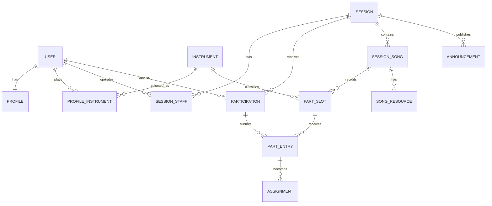

# データモデルと業務ルール

MVPの概念モデルと状態遷移を定義する。テーブル名やカラム型などの物理設計は実装前に確定する。

## 概念モデル



## エンティティ

### User / Profile

Userは認証単位。Profileは自己紹介、活動地域、経験レベルなど音楽活動に関する公開情報を持つ。プロフィール画像はMVP対象外とし、将来拡張とする。

### Instrument / ProfileInstrument

楽器・パートのマスターと、ユーザーが演奏できる楽器の関連。ボーカル、ギター、ベース、キーボード、ドラムなどを初期値として持つ。

検索や編成表の表記揺れを防ぐため、基本はマスターから選択する。ProfileInstrumentには経験年数、自己申告レベル、補足を持たせる。

### Session

開催される音楽セッション。

- タイトル、説明
- 開催日時、会場、地域
- 参加費、募集人数
- レベル感、ジャンル
- 参加申込期限、曲応募期限
- 公開状態

### SessionStaff

ユーザーとセッションの運営関係。役割は`owner`（主催者）または`staff`（運営メンバー）。各セッションには必ず1名のownerを置く。

### Participation

イベント自体への参加申込。

- 申込者
- 申込時の楽器、レベル
- 演奏参加または見学
- 自己紹介、主催者へのメッセージ
- 審査状態
- 申込日時、処理日時

プロフィール変更後も申込時の内容を確認できるように、申込時回答はParticipation側にも保持する。

### SessionSong

セッションで演奏候補となる課題曲。

- 曲名、アーティスト名
- 原曲キー、演奏キー
- 演奏時間の目安
- 曲構成、演奏メモ
- セットリスト順
- 公開状態

### PartSlot

曲ごとに募集するパート枠。

- 対象楽器・パート
- 必要人数
- 必須または任意
- 募集停止状態
- 補足

ツインギターなどに対応するため、必要人数は1に固定しない。

### PartEntry

承認済み参加者による曲・パートへの応募。

- 応募対象のパート枠
- 希望順位
- キー変更希望
- コーラス、持ち替えへの対応可否
- コメント
- 選考状態

### Assignment

応募から確定した実際の担当履歴。PartEntryの状態だけで確定を表現せず、確定のたびにAssignmentを新規作成して履歴を残す。`released_at`がNULLの行だけを現在有効な担当とする。

- 元になった応募
- 担当者、対象パート枠
- 確定操作をした運営者
- 確定日時、解除日時

### SongResource

曲に紐づく参考音源、譜面、コード譜などの資料。MVPではファイルアップロードよりURL共有を優先する。資料ごとに`public`（一般公開）または`participants`（承認済み参加者と運営者のみ）の公開範囲を持つ。初期値は`participants`とする。

### Announcement

セッション参加者への一斉連絡。タイトル、本文、公開日時、作成者を持つ。

## 状態遷移

### セッション

```text
draft（下書き）
  -> published（募集中）
  -> closed（募集終了）
  -> completed（開催終了）

draft / published / closed
  -> cancelled（開催中止）
```

公開後も編集できるが、日時、会場、参加費などの重要項目を変更した場合は参加者へ通知する。

### 参加申込

```text
pending（承認待ち）
  -> approved（参加承認）
  -> rejected（見送り）

pending / approved
  -> cancelled（キャンセル）
```

曲・パートへ応募できるのは、`approved`かつ演奏参加（`performer`）の参加者だけとする。加えて、イベントが募集中、曲が公開中、パート枠が受付中、応募期限内である必要がある。

### 曲・パート応募

```text
applied（応募中）
  -> on_hold（保留）
  -> selected（担当確定）
  -> rejected（見送り）

applied / on_hold / selected
  -> cancelled（応募取消）
```

担当確定のたびにAssignmentを作成する。確定解除時は現在有効なAssignmentに解除日時を記録し、応募を必要に応じて`applied`または`cancelled`へ戻す。再確定時は過去行を上書きせず、新しいAssignmentを作成する。

## 編成状態の自動判定

パート枠の状態は保存値ではなく、応募数、必要人数、現在のAssignment数から算出する。

- `募集中`：確定人数が必要人数未満で、有効な応募がない
- `選考中`：確定人数が必要人数未満で、有効な応募がある
- `確定`：確定人数が必要人数以上
- `募集停止`：主催者が応募受付を停止している
- `再募集中`：一度必要人数に達した後、確定解除により不足した

必須のPartSlotがすべて`確定`なら、曲全体を`成立`と判定する。任意パートの不足は成立判定に影響しない。

## 主要な業務ルール

1. イベント参加と曲・パート応募は別の申込として扱う。
2. `approved`かつ`performer`の参加者だけが曲・パートへ応募できる。
3. 同じパート枠に複数人が応募できる。
4. 同じ参加者による同じパート枠への重複応募はできない。
5. 担当は主催者または運営メンバーが確定する。
6. 必要人数を超える確定操作は、警告を出して原則禁止する。
7. 参加キャンセル時は未確定応募を取り消し、確定担当を解除する。
8. 確定解除で必要人数を下回ったパート枠は再募集状態になる。
9. 公開済みの演奏キーや演奏メモを変更した場合は担当者に通知する。
10. ownerは、別の運営メンバーへownerを移譲しない限り削除できない。
11. 応募時はイベントが`published`、曲が公開中、パート枠が受付中、かつ応募期限内でなければならない。
12. 参加定員は承認済みParticipationの人数とし、演奏参加者と見学者の両方を数える。owner・staffはParticipationを持つ場合だけ数える。
13. 応募曲数と担当曲数は、PartEntryやAssignmentの行数ではなく、異なる課題曲の数で数える。
14. 有効な応募の希望順位は、参加者ごとに1から始まる欠番のない連番とする。応募取消・見送り後は残った応募を自動的に詰め直す。

## MVPで確定した設計判断

- 参加申込は主催者または運営メンバーによる承認制とする。
- 応募曲数と担当曲数の上限はイベントごとに設定でき、未設定時は無制限とする。同じ曲の複数パートは1曲として数える。
- 希望順位はイベント内の参加者単位で一意とする。
- 見送り理由は必須にせず、運営者が任意のメッセージを応募者へ送れるようにする。
- 参加者によるキャンセルは即時確定し、運営者へ通知する。
- MVPの演奏資料は外部URLのみとし、ファイルアップロードは含めない。

先着自動承認、キャンセル承認制、ファイルアップロードは将来の拡張候補とする。
