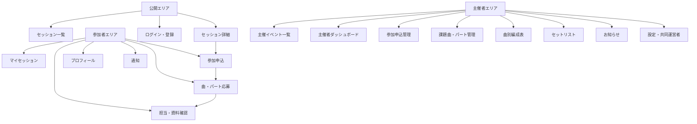

# フロントエンドUI設計

## 前提

- Laravel 12、Inertia.js 2、React 19、TypeScript、Tailwind CSS 4を使用する。
- MVPはスマートフォン対応のWebアプリとする。
- 既存のダークテーマを基礎にし、情報量が多い編成画面でも可読性を優先する。
- 独立したSPA用APIは設けず、InertiaのページPropsとフォーム送信を使用する。
- 初期実装では新しいUIライブラリを必須にせず、React、Tailwind、ネイティブHTML要素で構成する。
- 現在の一部画面には日本語の文字化けがあるため、UI実装開始時にソースをUTF-8へ統一する。

## 設計目標

1. 参加者が「応募できる曲」「現在の状態」「次にすること」を迷わず把握できる。
2. 主催者が「未処理の申込」「不足パート」「調整が必要な応募」を優先順に処理できる。
3. 曲別編成表はデスクトップで一覧性を保ち、スマートフォンでは横長テーブルに依存しない。
4. 状態を色だけで表現せず、ラベルとアイコンまたは補助文を併用する。
5. 競合し得る承認・担当確定操作では、サーバーの確定結果を正として表示する。

## 情報アーキテクチャ



## レイアウト

### PublicLayout

未ログインでも利用できる公開画面用。

- ヘッダー：ロゴ、セッションを探す、主催する、ログインまたはユーザーメニュー
- 本文：最大幅`max-w-7xl`を基本とし、詳細ページは読みやすい幅に制限
- フッター：利用規約、プライバシーポリシー、問い合わせ

### AppLayout

ログイン後の参加者向け共通レイアウト。

デスクトップ：

- 上部ヘッダーにロゴ、セッション検索、マイセッション、主催イベント、通知、ユーザーメニュー
- 本文は`max-w-7xl`

モバイル：

- 上部にロゴ、通知、ユーザーメニュー
- 主要導線は下部ナビゲーションに「探す」「参加予定」「主催」「プロフィール」の4項目
- 下部ナビゲーションとコンテンツが重ならない余白を確保

### ManageEventLayout

イベント管理画面用。イベント名と状態を常に確認できるコンテキストヘッダーを持つ。

管理メニュー：

1. 概要
2. 参加申込
3. 課題曲
4. 編成表
5. セットリスト
6. お知らせ
7. 設定

デスクトップではサイドナビゲーション、モバイルでは現在地が分かる「管理メニュー」選択UIに切り替える。

## レスポンシブ基準

| 幅 | 基本構成 |
| --- | --- |
| 320〜639px | 1カラム、カード中心、主要操作は幅広ボタン |
| 640〜1023px | 1〜2カラム、フィルターと補助情報を折りたたみ可能 |
| 1024px以上 | 2カラム、管理サイドナビ、編成テーブルを表示 |

タッチ操作の対象は原則44px以上とする。デスクトップの表を単純に横スクロールさせるのではなく、モバイル専用のカード表現へ切り替える。

## 視覚表現

### カラー

既存のSlate系ダーク背景とIndigo系アクセントを維持する。

- 背景：Slate 950
- 表面：Slate 900
- 境界：Slate 700〜800
- 主要操作：Indigo 500〜600
- 成立・確定：Emerald系
- 選考中・注意：Amber系
- エラー・中止：Rose系
- 情報・応募中：SkyまたはIndigo系

色だけに依存せず、すべての状態に日本語ラベルを表示する。

### タイポグラフィ

- 基本フォントは既存のInstrument Sansとシステムフォント
- ページタイトルは`text-2xl`〜`text-3xl`
- セクションタイトルは`text-lg`〜`text-xl`
- 本文は`text-sm`〜`text-base`
- 補足情報でも12px未満にしない

### 状態ラベル

共通の`StatusBadge`を使用する。

| 対象 | 状態ラベル |
| --- | --- |
| イベント | 下書き、募集中、募集終了、開催終了、開催中止 |
| 参加申込 | 承認待ち、参加承認、見送り、キャンセル |
| 応募 | 応募中、保留、担当確定、見送り、取消 |
| パート枠 | 募集中、選考中、確定、募集停止、再募集中 |
| 曲 | 未成立、調整中、成立 |

## 共通コンポーネント

### ナビゲーション・構造

- `PublicHeader`
- `AppHeader`
- `MobileBottomNavigation`
- `ManageEventNavigation`
- `PageHeader`：タイトル、説明、主要操作1つ
- `Breadcrumbs`：管理画面の深い階層だけで使用

### 表示

- `StatusBadge`
- `EventCard`
- `SongCard`
- `PartSlotStatus`
- `UserSummary`
- `DeadlineNotice`
- `EmptyState`
- `Pagination`
- `FlashMessage`
- `FieldErrorSummary`

### 入力・操作

- `TextField`
- `TextAreaField`
- `SelectField`
- `CheckboxGroup`
- `InstrumentSelector`
- `DateTimeField`
- `PrimaryButton`
- `SecondaryButton`
- `DangerButton`
- `ConfirmDialog`
- `Drawer`

フォーム部品は`id`、`label`、`error`、`description`を共通Propsとして持ち、エラー文を入力欄と関連付ける。

### データ表示

- `DataTable`：デスクトップ向け
- `ResponsiveCardList`：モバイル向け
- `LineupGrid`：デスクトップの曲別編成表
- `LineupSongCard`：モバイルの曲別編成
- `ApplicantList`
- `PriorityEditor`

`DataTable`と`ResponsiveCardList`は同じデータを受け取り、CSSだけで無理に変形せず、画面幅に応じて適切なマークアップを出し分ける。

## 主要画面

### セッション一覧

デスクトップでは左にフィルター、右に検索結果を配置する。モバイルではフィルターをDrawerに収め、適用中の条件だけを一覧上部に表示する。

イベントカードの情報順：

1. 開催日と募集状態
2. タイトル
3. 地域・会場
4. ジャンルとレベル
5. 不足パート
6. 参加費・申込期限

カード全体をリンクにせず、タイトルを詳細リンクとする。内部のパート絞り込みなど別操作との競合を避ける。

空状態は「条件に合うセッションがありません」とし、条件解除ボタンを表示する。

### セッション詳細

デスクトップは本文と申込サマリーの2カラム、モバイルは1カラムとする。

本文：

- タイトル、状態、主催者
- 日時、会場、参加費、期限
- 説明、参加条件
- 課題曲一覧とパート状況
- 注意事項

申込サマリー：

- 残り定員または定員情報
- 申込期限
- 現在のユーザー状態
- 「参加を申し込む」または次に必要な操作

モバイルでは申込操作を本文冒頭と末尾の両方に置き、固定ボタンだけに依存しない。

### 参加申込

1ページのフォームとし、入力を以下のセクションに分ける。

1. 参加方法：演奏参加または見学
2. 演奏可能な楽器：演奏参加者のみ
3. 経験・自己紹介
4. 主催者へのメッセージ
5. 申込内容確認

送信後はマイセッション詳細へ遷移し、「承認待ち」と次の流れを表示する。

### 曲・パート応募

上部に応募期限、応募曲数上限、現在の応募曲数を表示する。

曲ごとに以下を表示する。

- 曲名、アーティスト、演奏キー
- 参考音源
- パート枠の状態、必要人数、現在の確定人数
- 応募ボタン

応募追加時の順位は自動的に末尾へ置く。希望順位は別の`PriorityEditor`でまとめて変更する。

`PriorityEditor`はドラッグ操作だけに依存せず、各項目に「上へ」「下へ」ボタンを用意する。保存時は有効応募のIDを表示順で一括送信する。応募取消後はサーバーが圧縮した順位で再描画する。

### マイセッション詳細

画面冒頭に現在状態と次の操作を表示する。

- 承認待ち：審査待ちの説明
- 参加承認：曲・パート応募への導線
- 担当確定：演奏曲と資料への導線
- キャンセル：キャンセル済み表示

本文セクション：

1. 開催概要
2. 確定した担当
3. 応募中・保留中の曲
4. 演奏資料
5. お知らせ
6. キャンセル操作

キャンセルは破壊的操作として確認Dialogを表示し、確定担当がある場合は解除される曲を明示する。

### 主催者ダッシュボード

情報を大量の数値カードにせず、「次に処理すること」を中心にする。

上部に最大4つの要約を表示する。

- 承認待ち
- 未処理応募
- 不足パート
- 成立曲

その下に優先タスクを表示する。

1. 期限が近い未処理申込
2. 希望が重複しているパート
3. キャンセルで再募集になった枠
4. 公開前の不足設定

各要約は対応する管理画面へのリンクにする。

### 参加申込管理

デスクトップは表、モバイルは申込者カードを使う。

表示項目：

- 申込者
- 演奏・見学区分
- 楽器
- レベル
- 申込日時
- 状態

承認・見送りは詳細DrawerまたはDialog内で行い、プロフィールとメッセージを確認してから確定する。承認ボタンには残り定員を併記する。

### 課題曲・パート管理

曲ごとの編集セクションに、基本情報、パート枠、演奏資料をまとめる。

- 曲追加後、その曲の編集領域を開く
- パート枠は楽器、表示名、必要人数、必須・任意、受付状態を編集
- 公開済み曲の削除操作は「非公開にする」と表示
- 演奏キーや演奏メモの重要変更時は通知対象を説明

### 曲別編成表

本サービスの中心画面。

デスクトップ：

- 行：課題曲
- 列：イベント内で使用するパート種別
- セル：状態、確定者、応募人数
- セルをボタンとして選択すると、右側Drawerに応募者一覧を表示

モバイル：

- 曲ごとの`LineupSongCard`
- カード内にパート枠を縦並び
- 各枠に状態、確定者、応募人数、詳細ボタン

セルや枠は、色に加えて「募集中」「応募2名」「確定：山田」のような文字を表示する。

応募者Drawer：

- 募集人数と現在の確定人数
- 応募者名、希望順位、楽器経験、コメント
- 保留、見送り、担当確定
- 同時更新で枠が埋まった場合のサーバーエラー

担当確定は楽観的更新を行わず、成功レスポンス後に編成表を更新する。処理中は同じDrawer内の確定操作を無効化する。

### セットリスト

曲順を縦一覧で表示し、「上へ」「下へ」で並べ替える。ドラッグ操作を追加する場合も、キーボード用ボタンを残す。

各曲には演奏キー、担当者、想定時間を表示する。画面下部に合計演奏時間を表示する。

### お知らせ

一覧、作成・編集、公開確認を同じ管理セクション内で行う。

- 下書きと公開済みを明確に区別
- 公開前に通知対象とメール送信有無を表示
- 公開済みのお知らせは本文を変更せず、訂正は新しいお知らせとして作成する

### イベント作成・設定

巨大なウィザードにせず、イベント下書きを早く作成してから管理画面で詳細を追加する。

初回作成フォーム：

- タイトル
- 開催日時
- 会場
- 地域

作成後は設定画面へ移り、説明、参加費、定員、期限、レベル、ジャンル、曲数上限を追加する。公開前には`PublishChecklist`を表示する。

公開チェック項目：

- 必須の開催情報
- 参加申込期限
- 1曲以上の公開課題曲
- 各公開曲に1つ以上の必須パート枠
- 主催者の公開プロフィール

## ページコンポーネント配置

```text
resources/js/
  Components/
    Actions/
    DataDisplay/
    Events/
    Forms/
    Lineup/
    Navigation/
  Layouts/
    PublicLayout.tsx
    AppLayout.tsx
    ManageEventLayout.tsx
    GuestLayout.tsx
  Pages/
    Events/
      Index.tsx
      Show.tsx
      Participation/Create.tsx
      Entries/Index.tsx
    My/Events/
      Index.tsx
      Show.tsx
    Manage/Events/
      Index.tsx
      Create.tsx
      Show.tsx
      Edit.tsx
      Participations/Index.tsx
      Songs/Index.tsx
      Lineup/Show.tsx
      Setlist/Edit.tsx
      Announcements/Index.tsx
      Staff/Index.tsx
    Profile/
      Edit.tsx
    Notifications/
      Index.tsx
```

ページ固有の小さな部品はページディレクトリ内に置き、2画面以上で使うものだけ`Components`へ昇格する。汎用化を先行させない。

## TypeScript型

バックエンドから渡すPropsは、ページごとに明示的な型を定義する。共通のドメイン表示型は`resources/js/types`へ置く。

```text
types/
  auth.ts
  event.ts
  participation.ts
  song.ts
  lineup.ts
  pagination.ts
```

保存用の英語status値と、日本語表示ラベルを分ける。フロントエンド側で未知のstatusを黙って表示せず、開発時に検出できるよう網羅的なマッピングを使う。

個人情報を含まない公開用型と、主催者画面用型を分離する。

## Inertiaの状態管理

- フォームは`useForm`を使用する。
- 検索条件はURLクエリを正とし、ブラウザの戻る・進むで復元できるようにする。
- 一覧の検索更新では`preserveState`と`replace`を使用する。
- 更新成功後はサーバーPropsを再取得し、権限・上限・編成状態をサーバー結果へ同期する。
- 担当確定、参加承認、キャンセルは楽観的更新を行わない。
- 二重送信防止のため、`processing`中は同じ送信ボタンを無効化する。
- DrawerやDialogを閉じても未送信入力がある場合は破棄確認を行う。

## 画面状態

各ページは以下を設計対象に含める。

### 読み込み

Inertia初回表示はサーバーから完成したPropsを受け取る。部分リロード中は操作対象だけに進行表示を出し、画面全体を空にしない。

### 空状態

空である理由と次の操作を1つ示す。

- 課題曲なし：「最初の課題曲を追加」
- 参加申込なし：「募集ページを確認」
- 応募なし：「募集中のパートを確認」
- お知らせなし：「最初のお知らせを作成」

### エラー

- 項目エラーは該当入力の直下
- 複数項目または業務ルール違反はフォーム上部の`FieldErrorSummary`
- 競合エラーは操作箇所の近くに表示し、「最新状態を表示」できるようにする
- 403、404、500は専用ページを用意する

### 成功

ページ上部のFlashMessageで通知し、フォーカスまたは`aria-live`で支援技術にも伝える。担当確定など即時性が高い操作はDrawer内にも短い結果を表示する。

## 確認が必要な操作

| 操作 | 確認内容 |
| --- | --- |
| 参加キャンセル | 取消される応募・解除される担当 |
| 担当解除 | 対象者、曲、パート、再募集の有無 |
| イベント中止 | 通知対象人数と取り消せない影響 |
| 主催者移譲 | 移譲先と自分の変更後権限 |
| 公開済み曲の非公開 | 編成・参加者への影響 |
| お知らせ公開 | 通知対象とメール送信設定 |

確認Dialogの主要ボタンには「実行する」ではなく、「イベントを中止」「参加をキャンセル」のように具体的な動詞を使う。

## アクセシビリティ

- ページごとに一意の`h1`を置く。
- 入力には常に可視ラベルを付ける。placeholderをラベル代わりにしない。
- フォーカスリングを削除しない。
- DialogとDrawerはフォーカスを内部へ移動し、閉じた後は起点へ戻す。
- 状態変更は`aria-live`で通知する。
- 編成表はデスクトップでは意味のある`table`として実装する。
- クリック可能な表セルは`button`を内包し、セル自体へクリックイベントだけを付けない。
- ドラッグ操作には上・下ボタンを併設する。
- 色以外にラベル、記号、説明文を使う。
- `prefers-reduced-motion`を尊重する。
- 320px幅、200%ズーム、キーボード操作で主要フローを確認する。

## 実装順

1. 文字コード修正と共通デザイントークン
2. PublicLayout、AppLayout、ManageEventLayout
3. フォーム部品、ボタン、StatusBadge、FlashMessage
4. セッション一覧・詳細
5. イベント作成・設定・公開チェック
6. 課題曲・パート管理
7. 参加申込とマイセッション
8. 曲・パート応募とPriorityEditor
9. 参加申込管理
10. 曲別編成表と応募者Drawer
11. セットリスト、資料、お知らせ、通知
12. レスポンシブ・アクセシビリティの通し確認

## UI受け入れ基準

- 320px幅で主要操作が横にはみ出さない。
- 未ログインユーザーが一覧から詳細、参加申込の入口まで到達できる。
- 承認済みperformerが曲・パート応募と順位変更を完了できる。
- observerには曲・パート応募操作を表示しない。
- 主催者が承認待ち申込と不足パートをダッシュボードから1操作で開ける。
- デスクトップとモバイルの両方で、曲・パート・応募者・確定者の関係が分かる。
- 状態が色だけに依存せず、文字で判別できる。
- 競合エラー後に最新状態を取得し、同じ操作を安全にやり直せる。
- キーボードだけで参加申込、曲応募、承認、担当確定ができる。
- 破壊的操作は影響範囲を確認してから実行される。
