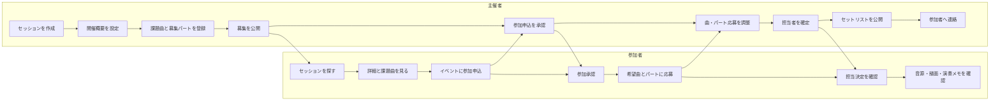

# 画面構成とユーザーフロー

## 基本方針

「イベントへの参加申込」と「曲・パートへの応募」を分ける。参加者は、主催者からイベント参加を承認された後に課題曲のパートへ応募できる。

## 全体フロー

## 画面一覧

### 1. セッション一覧

公開中のセッションを探す画面。開催日、地域、会場、ジャンル、参加条件、参加費、募集状況、不足パート、申込期限を表示する。

MVPでは、開催日、地域、ジャンル、楽器・パートで絞り込めるようにする。

### 2. セッション詳細

開催概要と課題曲の編成状況を表示する。

- タイトル、日時、会場
- 参加費、募集人数、レベル感
- 主催者、注意事項
- 課題曲と曲ごとの募集パート
- 参加申込ボタン

未ログインでも閲覧でき、参加申込時にログインを求める。

### 3. 参加申込

イベント自体への参加を申し込む画面。

- 演奏する楽器
- 経験年数または自己申告レベル
- 自己紹介
- 主催者へのメッセージ
- 演奏参加または見学のみ

### 4. 曲・パート応募

参加承認済みのユーザーが、希望曲とパートへ応募する画面。

- 希望曲、希望パート
- 希望順位
- キー変更希望
- コーラス、持ち替えへの対応可否
- コメント

同じ曲の同じパートに複数人が応募できる。応募のみでは担当確定にならない。

### 5. 参加者マイページ

- 参加予定のセッション
- 参加申込の状態
- 応募中の曲・パート
- 担当が確定した曲・パート
- 参考音源、譜面、演奏メモ
- 主催者からのお知らせ
- キャンセル申請

### 6. 主催者ダッシュボード

- 参加申込数、承認待ち人数
- 成立した曲数
- 不足パートがある曲数
- 未処理の曲・パート応募数
- キャンセル発生状況

主催者が次に処理すべき項目を優先して表示する。

### 7. 曲別編成表

本サービスの中心となる管理画面。曲を行、募集パートを列として、募集状況と担当者を一覧表示する。

各セルから以下を確認・操作できる。

- 募集人数、現在の状態
- 確定者
- 応募者と希望順位
- 応募者のプロフィール
- 確定、保留、見送り

### 8. セットリスト・共有資料

- 演奏順、担当メンバー
- 原曲キー、演奏キー
- 参考音源、譜面
- 曲構成
- イントロや終わり方などの演奏メモ

MVPでは、各曲の「上へ」「下へ」ボタンで曲順を変更する。ドラッグ操作を追加する場合も、キーボードで操作できるボタンを残す。

### 9. お知らせ

主催者がセッション参加者全員へ連絡する画面。タイトル、本文、公開日時を扱う。個別チャットはMVPに含めない。

## ユーザーの役割

- 一般閲覧者：公開情報の閲覧
- 参加者：参加申込、曲・パート応募、自分の情報変更
- 運営メンバー：参加承認、編成調整、情報更新
- 主催者：運営メンバーの権限に加えて、セッション設定と運営メンバー管理

役割はサービス全体ではなく、セッションごとに設定する。

## 実装順

1. ユーザー登録とプロフィール
2. セッション作成と公開
3. 課題曲と募集パートの登録
4. イベント参加申込と承認
5. 曲・パート応募
6. 曲別編成表と担当確定
7. 参加者マイページ
8. セットリストとお知らせ
